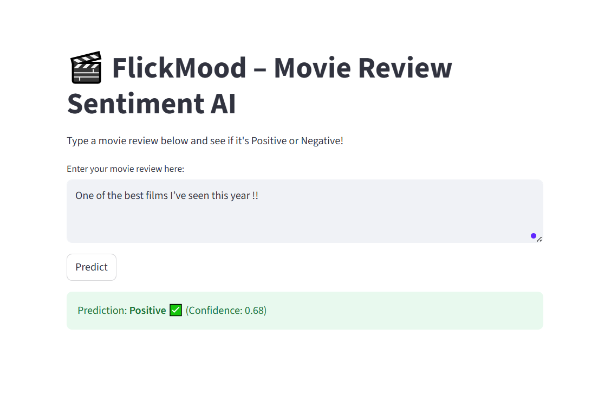
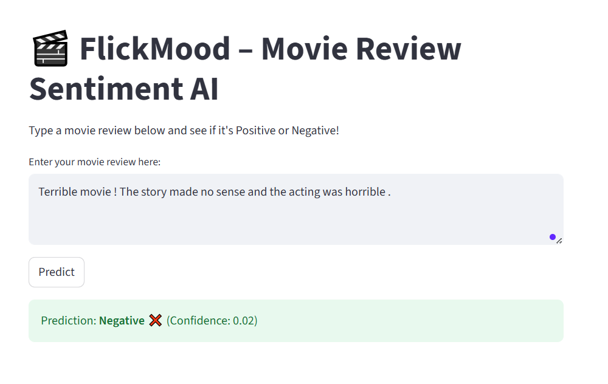
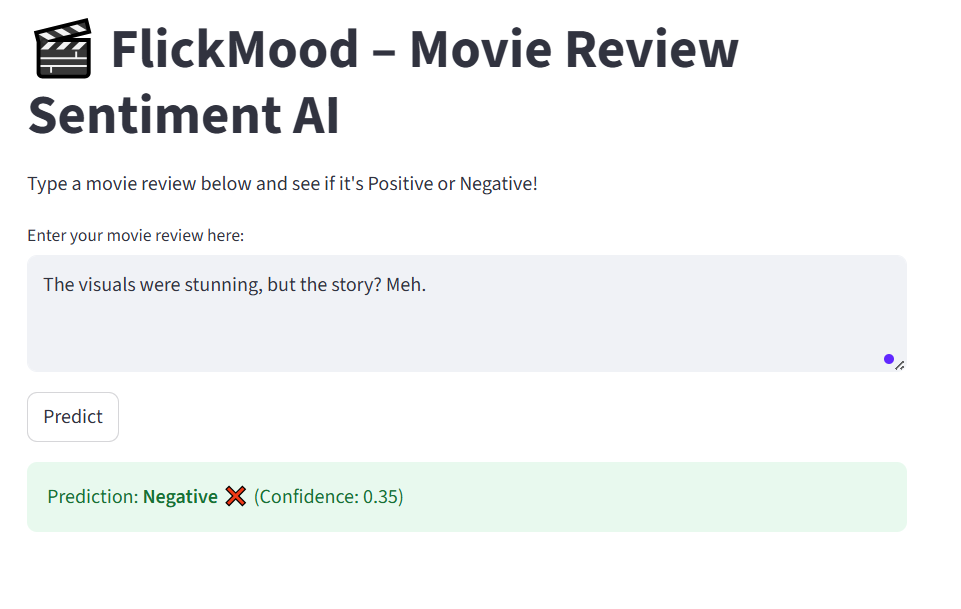
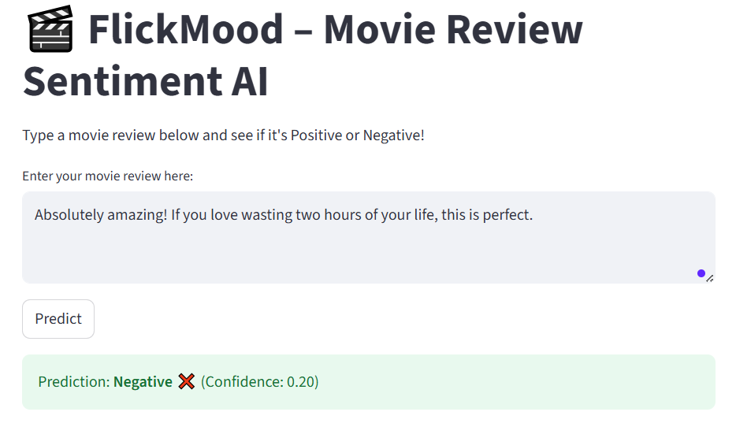

# 🎬 FlickMood – My Movie Review Sentiment AI

Hi there! 👋 I’m Myriam, and this is **FlickMood** 🍿, a fun AI project that predicts whether a movie review is **Positive ✅ or Negative ❌**.  

It’s built with **TensorFlow LSTM** and comes with a **Streamlit app**, so you can type a review and see the AI’s prediction instantly.  

---

## 💻 How it works
1. The model reads your review.  
2. It encodes words as numbers (thanks to the Keras IMDB dataset 😉).  
3. LSTM analyzes the sequence of words to predict sentiment.  
4. Streamlit displays the result in a **friendly web interface**.  

---

## 🚀 Try it Yourself

Open a terminal and run the following commands one by one:

```bash
# 1. Clone the repo
git clone https://github.com/MyriamLadhari/FlickMood.git
cd FlickMood

# 2. Create a virtual environment
python -m venv flickmood-env

# 3. Activate the virtual environment
# Windows
.\flickmood-env\Scripts\activate
# Mac/Linux
source flickmood-env/bin/activate

# 4. Install required packages
pip install tensorflow streamlit numpy

# 5. (Optional) Train the model yourself
python train.py
# You can skip this because I already trained the model.
# Download the pretrained model here:
# 👉 https://www.dropbox.com/scl/fi/mpb339v46gylo8uqe490m/sentiment_model.h5?rlkey=lue97kcxbw1y6lzo2sz8g9uzc&st=n4ydi8u4&dl=1


# 6. Run the Streamlit app
streamlit run app.py
```
## 📸 Demo Screenshots

- 🟢 **Positive ✅**  
    

- 🔴 **Negative ❌**  
    

- ⚡ **Tricky (Negative)**  
    

- 😏 **Sarcastic (Negative)**  
  


## 🔧 Tech Stack

Python 3.10+
TensorFlow / Keras – LSTM for NLP
Streamlit – Interactive web interface
NumPy – Data processing
IMDB dataset – Preloaded via Keras


## 👩‍💻 Developed by: Myriam Ladhari
